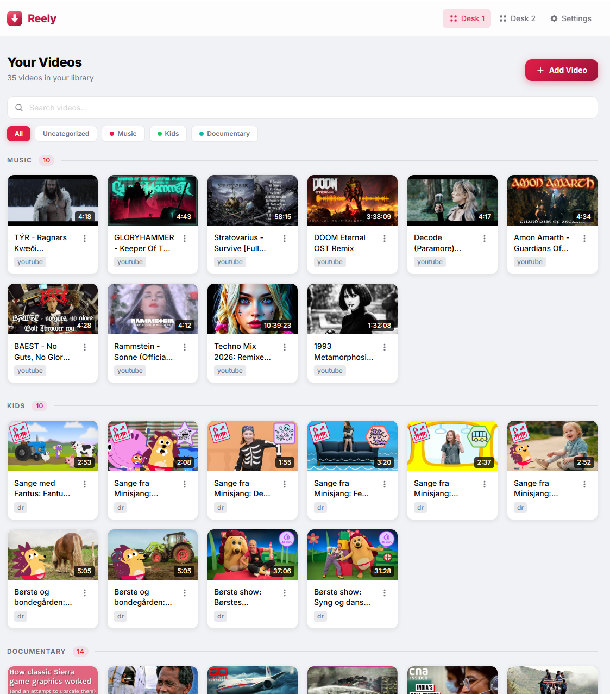

# Fetchr



[](LICENSE)
[](https://hub.docker.com/r/larsmikki/fetchr)
[](https://github.com/larsmikki/fetchr/pkgs/container/fetchr)
[](https://nodejs.org/)

**Fetchr** is a self-hosted video collection manager. Paste any video URL, and Fetchr saves it to your library — ready to stream in-browser or download. Organize your videos into collections, search across your library, and keep everything on your own machine.

## Features

- Paste any URL and Fetchr fetches the title, thumbnail, and metadata via yt-dlp
- **Stream in-browser** with a persistent bottom player — keep watching while you browse your library
- **Download** videos or extract MP3 audio directly to a folder on your server
- Organize into **collections** with custom colors
- Multiple **desktops** — separate workspaces for different libraries
- Full-text search across your video library
- Export and import your full library as a backup
- 10 built-in themes (light and dark)
- No tracking, no accounts, no cloud — your data stays on your machine

## Getting started

Pick whichever install path matches your setup. All paths land on [http://localhost:3030](http://localhost:3030).

> **Non-Docker installs** need `yt-dlp` and `ffmpeg` on `PATH`. The Docker image bundles both — nothing extra to install.

### 1. Docker (Docker Desktop, NAS, or any Docker server)

Works on Synology, Unraid, TrueNAS, QNAP, Proxmox, or a plain Docker host.

**One-liner:**

```bash
docker run -d \
  --name fetchr \
  -p 3030:3030 \
  -v fetchr-data:/app/data \
  --restart unless-stopped \
  larsmikki/fetchr:latest
```

**Docker Compose (recommended):**

```yaml
services:
  fetchr:
    image: larsmikki/fetchr:latest
    container_name: fetchr
    ports:
      - "3030:3030"
    volumes:
      - fetchr-data:/app/data
      # - /path/to/your/output:/output  # optional: mount a host folder for downloads
    restart: unless-stopped

volumes:
  fetchr-data:
```

To download videos to a folder on your host machine, uncomment the second volume line, set the host path, and configure the download path to `/output` in **Settings**.

### 2. Local install on Windows

Requires [Git for Windows](https://git-scm.com/download/win), [Node.js 20+](https://nodejs.org/), `yt-dlp`, and `ffmpeg`. The easiest way to get the binaries is via [Chocolatey](https://chocolatey.org/) or [Scoop](https://scoop.sh/):

```powershell
scoop install nodejs-lts git yt-dlp ffmpeg
git clone https://github.com/larsmikki/fetchr.git
cd fetchr
npm install
npm run dev
```

For a production build:

```powershell
npm run build
npm start
```

### 3. Local install on macOS

```bash
brew install node git yt-dlp ffmpeg
git clone https://github.com/larsmikki/fetchr.git
cd fetchr
npm install
npm run dev
```

For a production build:

```bash
npm run build
npm start
```

### 4. Local install on Linux

Debian/Ubuntu:

```bash
curl -fsSL https://deb.nodesource.com/setup_20.x | sudo -E bash -
sudo apt-get install -y nodejs git ffmpeg python3-pip
sudo pip3 install -U yt-dlp

git clone https://github.com/larsmikki/fetchr.git
cd fetchr
npm install
npm run dev
```

On Fedora/RHEL use `dnf install nodejs git ffmpeg yt-dlp`; on Arch use `pacman -S nodejs npm git ffmpeg yt-dlp`.

For a production build: `npm run build && npm start`.

## Configuration

| Variable | Default | Description |
|----------|---------|-------------|
| `PORT` | `3030` | Port the server listens on |
| `DATA_DIR` | `/app/data` | Directory for the database and downloaded videos |
| `FFMPEG_PATH` | `/usr/bin/ffmpeg` | Path to ffmpeg binary (pre-installed in Docker) |

## Usage

| Action | How |
|--------|-----|
| Add a video | Click **Add Video** and paste any URL |
| Play a video | Click the thumbnail — player appears at the bottom |
| Download video | Open a video's menu → **Download** |
| Extract MP3 | Open a video's menu → **Download MP3** |
| Organize | Create a collection and drag videos into it |
| Switch desktop | Use the desktop switcher in the header |
| Backup | **Settings → Export** |
| Restore | **Settings → Import** |

## Data and runtime folders

```
/app/data/
  data.db      # SQLite database (videos, collections, settings)
  videos/      # downloaded video files (if download path is inside /app/data)
```

## Troubleshooting

**Video fails to fetch metadata**
Some sites are not supported by yt-dlp or may require cookies. Check that the URL is publicly accessible and try updating to the latest Docker image (yt-dlp is updated with each release).

**Streaming doesn't work**
Fetchr streams directly from the source URL via yt-dlp. If the source site throttles or blocks server-side requests, playback may fail. Downloading the video first is a reliable alternative.

**Download path not working**
Make sure you have mounted a host folder into the container and set the path in **Settings → Download path** to match the container-side mount point (e.g. `/output`).

## License

[MIT](LICENSE)

## Support

If Fetchr saves you time, consider [buying me a coffee](https://buymeacoffee.com/larsmikki) or [donating via PayPal](https://paypal.me/larsmikki). It helps keep the project free and maintained.
